## Project Two: Improve Technical Trading Strategies Using Machine Learning Models
### Additional Installation:
**!pip install yfinance**

### Project Repo:
https://github.com/leongaoleon/Project2.git
  SSH: git@github.com:leongaoleon/Project2.git

### Files:
1. Project2_PART1_Returns_Signals_Sentiment.ipynb
2. Project2_PART2_ML.ipynb
3. Returns and Signal.csv
4. Resources
5. project2.pptx
6. README.md

### Instruction:
(1) Project2_PART1_Returns_Signals_Sentiment.ipynb is focus on downloading stock data and calculate technical trading signals.
  (2) Project2_PART2_ML.ipynb is focus on applying machine learning models to the combined trading signals, and to discuss the findings.
  Selecting a ticker in the first notebook to run codes, it will produce a csv file, then use that file to run the second notebook.

### **Project Two Job Descriptions:**
Liam Crogh: research and prepare trading indicators/signals.
Darren Forde: research and prepare the sentiment trading indicators/signals.
Khushboo Bhatnagar: research machine learning models.
Leon Gao: Consolidate codes for trading signals. Applying Marchine Learning Algos. And Producing model performance reports/summary.
Harrison Marcus Clark: prepare PPT

### **Project Two:**
**We want to exam if using machine learning (ML) models could improve the trading result of technical trading strategies (indicators).**

### **Data Preparation:**
In order to include the sentiment indicator, multiple sources of news have been examined, such as NEWS API, Returns. And we have made the decision to choose **2019-1-1 to current (2021-3-2)** as the time frame for downloading stock data (**daily prices**) from the YAHOO FINANCE, and news data from Financialmodelingprep for this project. As the maximum free news are only available for this period.

Data Cleaning:
a.	Stock data from YAHOO FINANCE is clean.
b.	For the News data, we have removed characters that are not letters, punctuations, and stop words. The cleaned title and text have been consolidated into “content” columns to be further analyzed via Vader.

The Testing Period:
2020-09-25 to 2021-03-02 

### **Trading Signals:**
**1. Exponential Moving Average (EMA) Crossover**
 When the short period EMA cuts above the longer period EMA, it is a bullish signal.
 When the short period EMA cuts below the longer period EMA, it is a bearish signal. 

**2. EMA of Daily Return Volatility**
When a short-window (fast) EMA of daily return volatility is greater than a long-window (slow) EMA of daily return volatility,   the crossover suggests that a short opportunity exists where daily return volatility is expected to rise. 
This is because during times of rising price volatility, there often exists a negative price bias (selling), and vice versa for when daily return volatility is expected to fall (buying).

#### **3. Bollinger Bands**
The upper band shows a level that is statistically high or expensive
 The lower band shows a level that is statistically low or cheap

When the asset closing price is less than the lower band, is a long opportunity.
 When the asset closing price is higher than the upper band, is a short opportunity. As the signal suggests that the price action will tend to move towards to the mean.

#### **4. On Balance Volume**
On Balance Volume (OBV) measures buying and selling pressure as a cumulative indicator, adding volume on up days and subtracting it on down days.
 The idea behind the indicator is that price follows volume, a widely held belief among many technical analysts.
 OBV Indicator is a momentum based indicator which measures volume flow to gauge the direction of the trend.

***OBV EMA is used to generating signals:*** 
 When OBV cuts above OBV EMA it is a bullish signal.
 When OBV cuts below OBV EMA it is a bearish signal.

#### **5. Scoring Sentiment Using VADER**
Following the recommendations from [this research paper](https://scholar.smu.edu/cgi/viewcontent.cgi?article=1051&context=datasciencereview), we will define a threshold of `0.1` to label a review as positive, if the `compound` score is greater than or equal to `0.1`, the news will be positive; if the `compound` score is below `-0.1`, the news will be negative.
  a. positive sentiment gives a buy signal
  b. negative sentiment gives a sell signal
  c. otherwise hold the position

### **Checking Correlations between Signals:**
**Perfect (high) positive or negative correlation suggests the signals are overlaps, and one of the indicators could be dropped.
 Zero or Low Correlated Singals are Preferred.**
 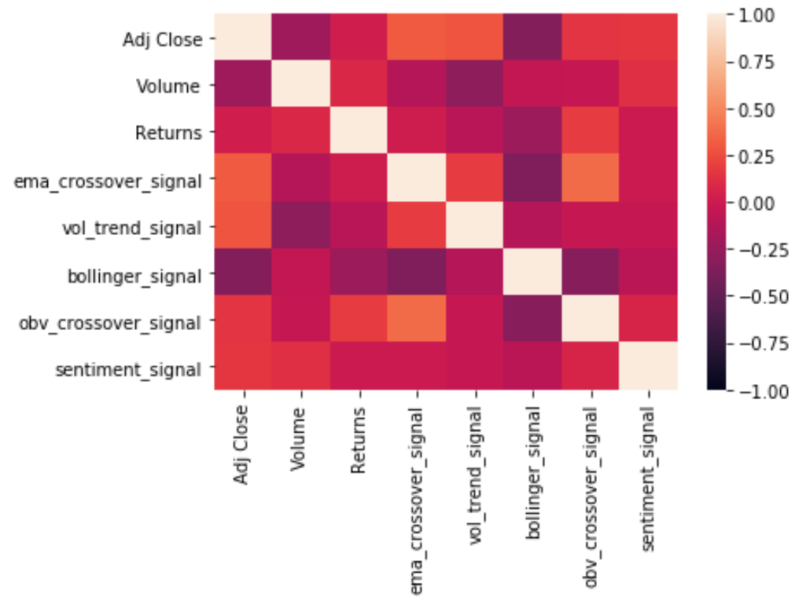
 According to the graph, these indicators have `low correlations` with each other, combing them might able to provide a more solid signal.

### Checking Imbalanced Data for Stock Returns
**289 for 1.0**
 **251 for 0.0**
 The stock returns is balanced and there is No NaN value.

### Creating X and Dependent Variables:
We are `shiffting` the X by 5 rows down, as we are going to hold the position for `five days`.

### Separate X and Y Training Datasets:
80% (training) 20% (testing) split

### Machine Learning Models Training:
#### 1. **Random Forest Model:**
Instead of having a single, complex tree like the ones created by decision trees, 
  a random forest algo will sample the data and build several smaller and simpler decision trees. 
  Each Tree is considered a "weak leaner" but when combined, the perfomrmance improved.
#### 2. **Gradient Boosting Model:**
Unlike the random forest model that trees learning separately, the boosting model, trees elarn from each other.
 For example, tree two learns from tree one in a sequence.
 So each tree has more information than the previous tree.

#### 3. **LSTM RNN Model:**
LSTM networks are a type of RNN that uses special units in addition to standard units.
 LSTM units include a 'memory cell' that can maintain information in memory for long periods of time.
 A set of gates is used to control when information enters the memory, when it's output and when it's forgotten.

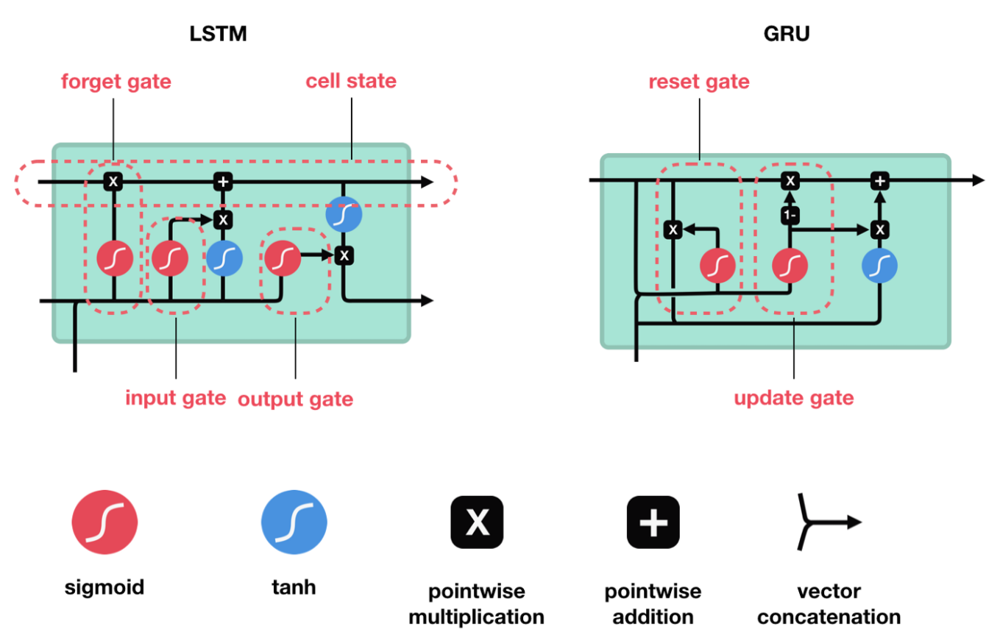

#### 4. **Gated Recurrent Unit (GRU) RNN Model:**
The key difference between GRU and LSTM is that GRU's bag has two gates that are reset and update 
 while LSTM has three gates that are input, output, forget. 
 GRU is less complex than LSTM because it has less number of gates. but GRU exposes the complete memory and hidden layers but LSTM doesn't. 

#### **Classification Report: Precision and Recall:**
Although **`Random Forest model`** has the highest `F1-score` in predicting increasing in stock prices, 
  it also has the worest performance in predicting dropping in prices.
    
**`Gradient boost model`** has the highest `F1-score` in predicting raising in stock prices,
  and it has the highest `F1-score` in predicting decreasing in prices.

#### **Precision and Recall Curve AUPRC:**
The area under the `PR curve (AUPRC)` is a metric for how good the model is in absolute terms. 
 It can be valuable when comparing one model to another.
 From the graph above, these four ML models performed similary in validating trading singals and predicting `EBAY` price movements.
 It is hard to tell whether `Graient Boost model` and `GRU RNN model` has larger area under precision and recall curve.
 But `Gradient boost model` has the highest `F1-score` in predicting raising in stock prices, and it has the highest `F1-score` in predicting decreasing in prices.

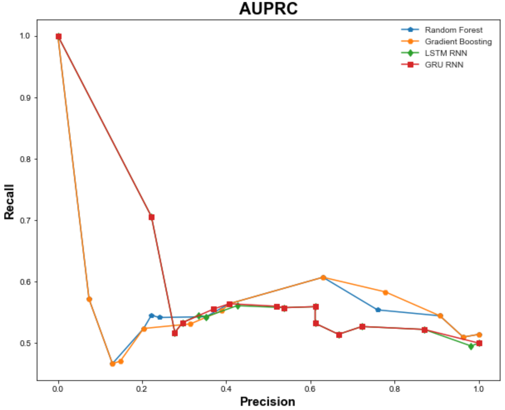
    
#### **Accuracy Scores Comparison:**

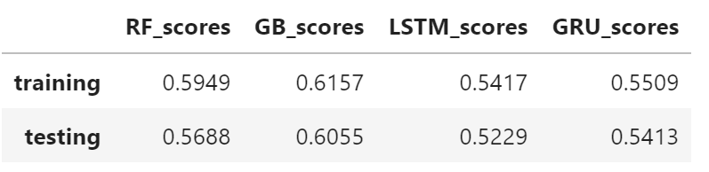    

  In general, the accuracy scores for training is higher than testing.
  From the table above, the `Gradient Boost Model` has the best performance with a accuracy of 60.55%,
  whereas `LSTM RNN model` has the worst performance with a accuracy of 52.29%.
  By comparing `F1-Scores`, `AUPRC`, and `Accuracy Scores`; `Gradient Boost Model` is recommended.    

## **Predicted Results vs. Actual Results:**
**`EBAY:`**
 The Graph below is the `accumulated returns` (test data set) for each individual technical indicator.

The blue line with little dots is the accumulated return for the stock over the testing period. And the others are the accumulated return for each indicator.
From the graph, it is clear that by using one indicator alone, it is highly unlikely able to generate returns that at least as good as, just simply buy and hold strategy.

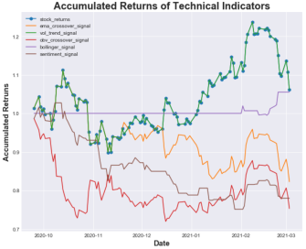

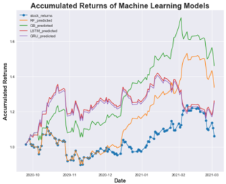

Instead of just relying on one particular indicator, we have combined `five technical indicators`.
 As these indicators have `low correlations` as described in `PART I`, combing them might provide a more solid signal.

These indicators might suggest `inconsistent` signals, so we will use ` ML models` to help with the decision.

With the assistance of ML models, to make decision on the combined signals, it is clear, from the graph that, 
  by combining five indicators and using ML methods, the trading decision could be improved.
  Especially, the `Gradient Boost model` outperforms other three ML models.

However, it is worth noting that, when analyse a different ticker (stock), the result changes.
 For example, `TESLA (TSLA)` and `Activision Blizzard (ATVI)` show different results.
 **In addition to test on `EBAY`, we have also tested on Other Tickers such as:**
    
**`TESLA:`**
 If switching the ticker to TESLA in the PART I, these indicators overlap with each other,
 because TESLA has been in a very strong upward momentum, these indicators just reflected on such strong trend.
 whereas bollinger band **failed**, as the prices cut its upper band, suggesting a `SELL Signal`, 
 but the fact is the TESLA stock price was hardly able to go down, because of the strong momentum.
 As the result, bollinger band strategy by itself is failed.

Due to the **inefficiency** of the indicators, ML **failed** to outperform, but **at least**, it could provide
  the **same** accumulated returns as buy-hold TESLA will achieved (overlapped curve in the graph).
    
    
**Accuracy Scores for TELSA:**

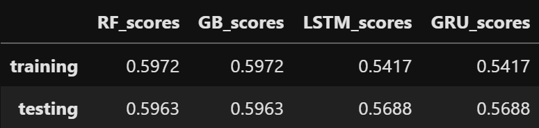

**Accumulated Returns for TELSA:**

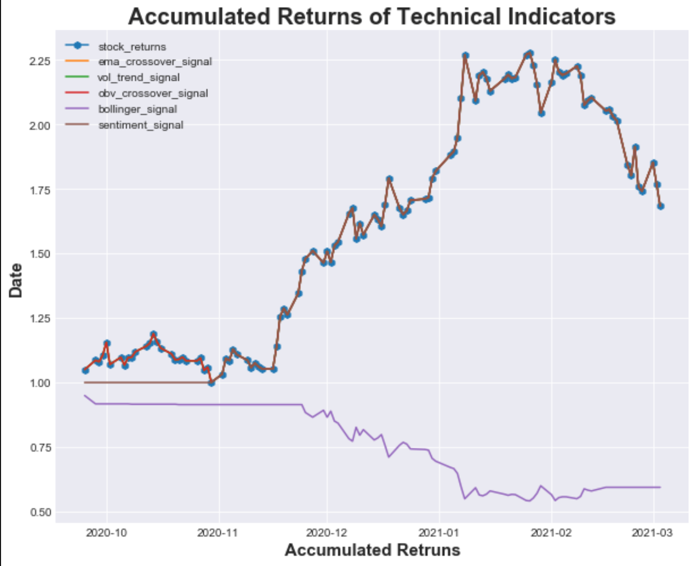

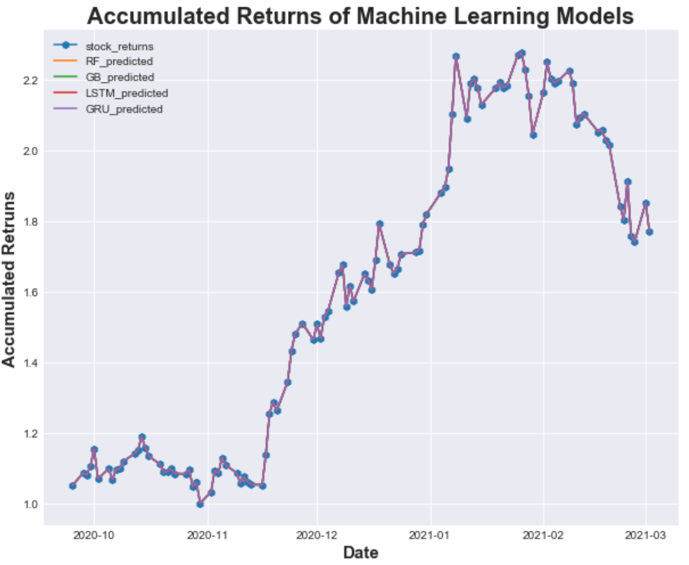

    
 **`ATVI:`**
  Similar to EBAY and TSLA, most indicators for ``ATVI`` could not outperform the stock buy-hold strategy,
  except for the ``sentiment indicator``, which leads to a much higher accumulated returns than buy-hold strategy.

With the help of ML models, only ``Gradient Boost Model`` able to outperform the buy-hold stock accumulated returns.

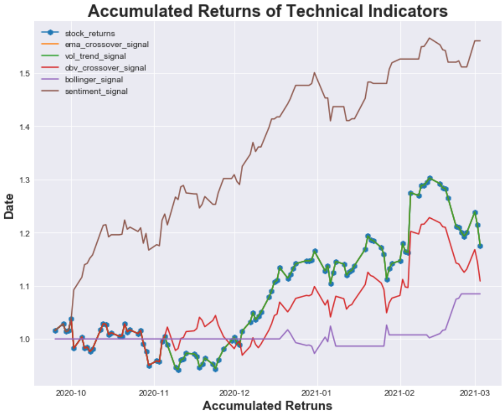

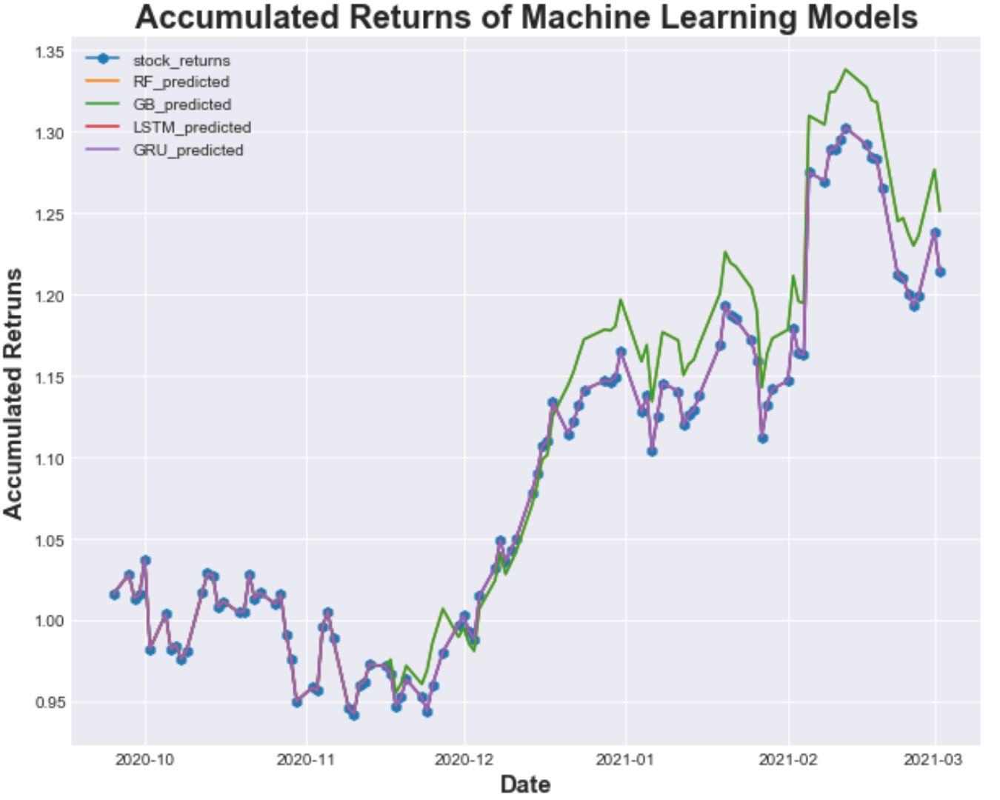
    
    
**Summary:** 
  **`Technical indicators`** by themselves usually **underperforms** the **``buy-hold``** stock trading strategy. 
  Using **`ML models`** to `combine the technical indicators`, could improve the accumulated returns. 
  Especially, the **``gradient boost model``** would be recommended.
  The **accuracy scores** for ML models are around **55% to 60%**.

In order to improve the **result/accuracy** of ML models, not only the `hyperparameters` of the **ML model** 
  needed to be carefully selected, but also, the `hyperparameters` of the **technical indicators** 
  needed to be tuned according to the trading style (our project is assuming a **``five-day``** trading strategy).

If without the time constraint, more indicators (`technical and fundamental indicators` i.e ratios) could be included, 
  and also more test on various combination of hyperparameters could be conducted.

Thus, further analysis is still required before applying the ML models to any investment decision.    
    
    
    
    
    
    
    

